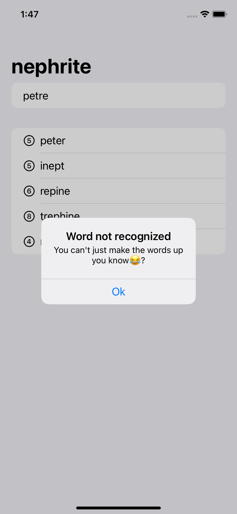

# WordScramble

WordScramble is an engaging word game developed using SwiftUI during the 100 Days of SwiftUI challenge with Hacking with Swift. The game presents users with a random 8-letter word loaded from a text file within the app bundle. Players are tasked with creating words from this word jumble, leveraging their vocabulary and anagram-solving skills.

## Key Learnings

During the development of this project, several key concepts and techniques were explored:

- **List Views**: Utilization of List Views styled with the `listStyle` modifier for an organized and visually appealing UI.
  
- **File Loading**: Loading files from the app bundle using URLs and the Bundle framework to access necessary data.
  
- **Lifecycle Handling**: Implementation of the `onAppear` modifier to trigger functions upon the appearance of specific views on screen.
  
- **Dictionary Usage**: Leveraging UI kit's  built-in iOS dictionary api UITextChecker to verify the validity of created words within the game.

## Screenshots

## Getting Started

To run this project locally, follow these steps:

1. Clone the repository to your local machine.
2. Open the project in Xcode.
3. Build and run the project on the desired simulator or device.

## Acknowledgments

This project was developed as part of the 100 Days of SwiftUI challenge by Hacking with Swift. Acknowledgment and gratitude to [Hacking with Swift](https://www.hackingwithswift.com/100/swiftui/31) for the invaluable learning resources and guidance.

